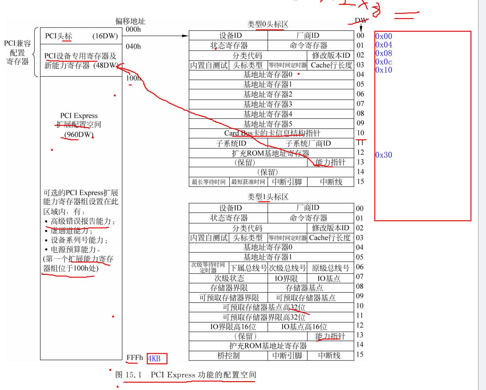
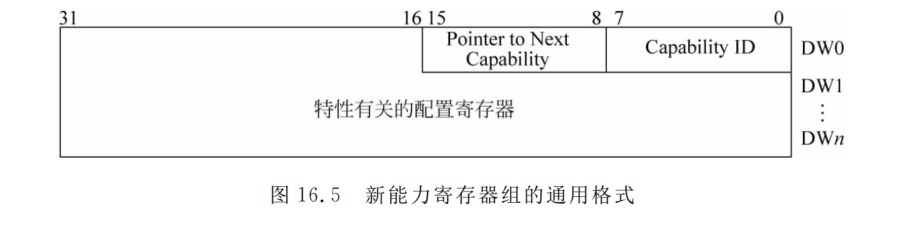
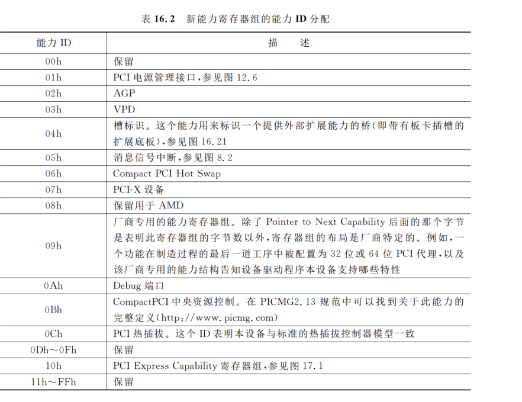
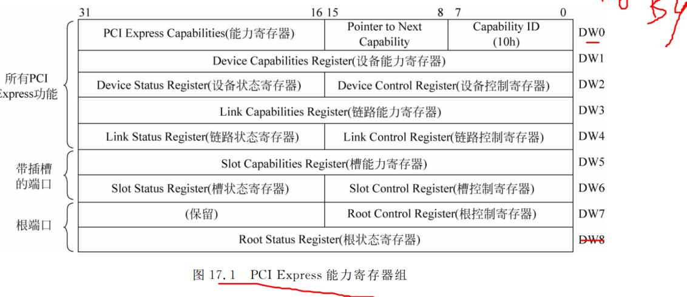
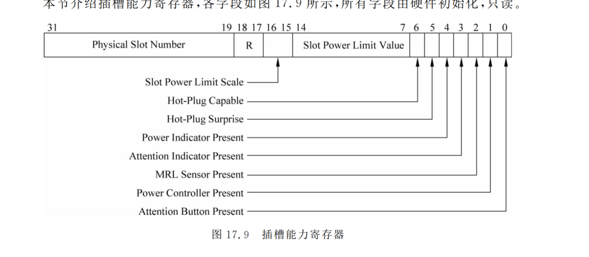
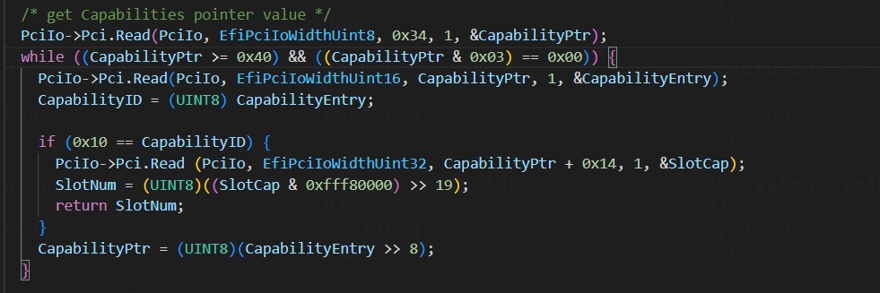
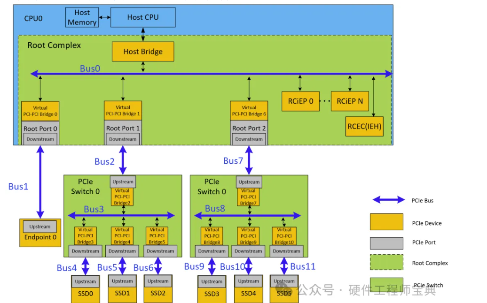
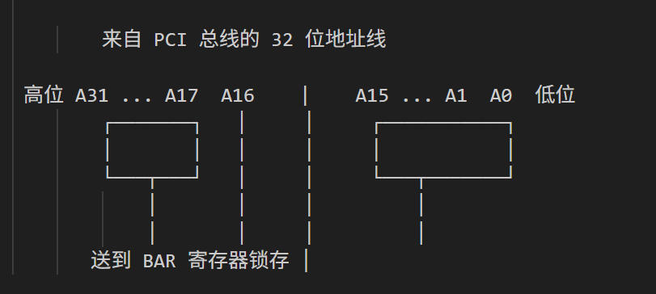

# PCIe配置空间

## 配置空间的结构是怎样的？有哪些重要的寄存器？
>配置空间分为两部分：前256字节的标准配置头和后面的扩展配置空间。

- 前64字节是所有设备都有的公共部分，包括Vendor ID、Device ID、Command、Status、Class Code、BAR等寄存器。

- 后面192字节根据设备类型不同而不同。Type 0是普通设备的配置头，Type 1是桥设备的配置头。
  
## PCI专用寄存器和新能力寄存器组
>第一个字节是能力寄存器ID，第二个字节是能力寄存器指针
  
- 能力寄存器ID，由PCI SIG统一分配，表寄存器组对应的特性
  
  
  
- 在 PCI 规范中明确要求：所有能力寄存器组的起始地址，必须是 4 字节（双字）对齐的。
  - 早期 PCI 主机桥、设备的硬件逻辑只支持对齐的 32 位访问
  - 能力寄存器指针的低两位必须为零。(双字对齐，四字节对齐)

## 读取slot

# PCIe BAR空间

## 什么是BAR（Base Address Register）？

BAR是配置空间里的一组寄存器，用来定义PCIe设备需要的内存或IO空间。

## BAR的作用：

PCIe设备通常需要一段地址空间来映射它的内部寄存器、缓冲区等资源。驱动通过访问这段地址空间来控制设备、读写数据。

BAR就是告诉系统"我需要多大的空间"，然后系统在枚举时给它分配一个基地址，写到BAR寄存器里。之后驱动就可以通过这个基地址来访问设备了。

## BAR的位置：

配置空间偏移0x10到0x24有6个BAR寄存器，编号BAR0到BAR5。每个BAR是32位的。

Type 0设备（普通设备）有6个BAR，Type 1设备（桥设备）只有2个BAR。

## BAR的内容：

- BAR寄存器的最低位表示地址空间类型：0表示内存空间，1表示IO空间。

- 对于内存空间，第1-2位表示地址宽度：00表示32位地址，10表示64位地址。第3位表示是否Prefetchable。高位是基地址。

- 对于IO空间，第1位保留，高位是基地址。

## 如何计算BAR空间的大小？

1. 向 BAR 写入 0xFFFFFFFF
2. 读回得到值 val
3. 取低地址位部分（屏蔽掉属性位）：
4. mask = val & 0xFFFFFFF0
5. 计算大小：size = ~mask + 1

##  64位BAR：

如果设备需要64位地址空间，会用两个连续的BAR。比如BAR0和BAR1组成一个64位BAR，BAR0存低32位地址，BAR1存高32位地址。这样实际只有5个可用的BAR空间（BAR0+1、BAR2+3、BAR4+5，或者BAR0、BAR1、BAR2+3、BAR4+5等组合）。

#  PCIe枚举过程

## 什么是PCIe枚举？详细过程是怎样的？

PCIe枚举是系统启动时，BIOS或操作系统扫描PCIe总线，发现所有设备，并给它们分配资源的过程。

## 为什么需要枚举：

PCIe设备是即插即用的，系统不知道有哪些设备、在哪里、需要什么资源。枚举就是让系统自动发现设备，读取设备信息，分配地址空间和中断号，让设备可以正常工作。

## 枚举的时机：

第一次枚举在BIOS阶段，BIOS会扫描所有PCIe设备，分配基本资源，让系统能启动。

第二次枚举在操作系统启动时，内核会重新扫描设备，可能重新分配资源，加载驱动。

如果支持热插拔，设备插入时也会触发枚举。

## 枚举的详细过程：

第一步，扫描总线。从Bus 0开始，依次访问每个Device（0-31）的每个Function（0-7），读取配置空间的Vendor ID。如果Vendor ID不是0xFFFF，说明设备存在。

第二步，读取设备信息。读取Device ID、Class Code、BAR等信息，判断设备类型和需求。

第三步，分配Bus号。如果发现桥设备，给它分配一个Secondary Bus号，然后递归扫描这个新总线。

第四步，探测BAR大小。往BAR写全1，读回来计算需要的空间大小。

第五步，分配地址空间。根据BAR的大小和类型，从可用的地址空间里分配一段，写到BAR寄存器。

第六步，分配中断号。给设备分配一个中断号，写到配置空间的Interrupt Line寄存器。

第七步，使能设备。设置配置空间的Command寄存器，使能内存访问、总线主控等功能。

## 枚举的结果：

枚举完成后，每个设备都有了唯一的BDF号（Bus:Device.Function），都分配了地址空间和中断号，可以被驱动访问了。

系统会建立一个设备树，记录所有设备的拓扑关系和资源分配情况。Linux下可以通过lspci命令查看枚举结果。

# 枚举过程中如何分配资源？

>枚举过程中，系统需要给每个设备分配地址空间和中断号，这叫做资源分配。

## bus资源分配

> 总线号的分配采用深度优先搜索 (Depth-First Search, DFS) 算法。

- 起始点： 枚举过程从Root Complex（根联合体）开始，Root Complex通常被分配为总线0。

- 桥的发现与分配： 当枚举软件发现一个PCI-to-PCI桥（例如PCIe交换机或Root Port）时，它会为该桥分配三个总线号：

- Primary Bus Number（主总线号）：桥连接的上游总线号。

- Secondary Bus Number（次总线号）：桥下游创建的新总线号。

- Subordinate Bus Number（从属总线号）：该桥下游所有总线中可能存在的最大总线号。

- 深度优先遍历： 分配完桥的总线号后，枚举软件会立即进入新创建的次总线（即桥的下游），继续对其进行枚举，然后再返回到上游总线继续搜索。

- 顺序分配： 总线号是根据发现的顺序依次分配的，确保每个总线都有一个唯一的标识符。

- 从图中可以看出左边的PCIe bus的号比右边的要小，因此左边的这些设备是优先被遍历的，遍历完左边的设备以后再依次遍历右边的设备。

- 最大数量： PCIe架构支持多达256个总线号（0到255）。

## 地址空间分配：

- 第一步，收集需求。扫描所有设备的BAR，计算每个设备需要多少内存空间、多少IO空间。

- 第二步，规划布局。系统有一段可用的地址空间，需要把它分配给各个设备。要考虑对齐要求、大小限制、Prefetchable属性等。

- 第三步，分配地址。从可用空间里分配一段给设备，写到BAR寄存器。要保证不同设备的地址空间不重叠。

- 第四步，配置桥设备。如果有桥设备，要配置它的Base和Limit寄存器，定义它转发的地址范围。这样桥设备才知道哪些地址要转发到下游。

## 分配策略：

- 系统会优先分配大的空间，然后分配小的空间，这样可以减少碎片。

- Prefetchable空间和Non-prefetchable空间分开分配，因为它们的属性不同。

- 64位BAR优先分配到高地址空间（4GB以上），32位BAR分配到低地址空间（4GB以下）。

### 中断号分配：

传统的INTx中断，系统会给每个设备分配一个中断号（IRQ号），写到配置空间的Interrupt Line寄存器。

MSI/MSI-X中断，系统会分配一个或多个中断向量，配置到MSI Capability或MSI-X Capability里。

### 资源冲突：

- 如果可用的地址空间不够，或者中断号不够，就会出现资源冲突。这时候有些设备可能分配不到资源，无法正常工作。

- 系统会尝试重新分配资源，或者禁用一些不重要的设备，来解决冲突。

# PCI bar空间大小，为什么不能直接返回而是需要读出后取反+1

## 资源角度
- 节省寄存器资源
- PCI 规范很早（1990 年代）就定死了：BAR 寄存器只有一个功能：存基地址没有额外寄存器专门存「大小」

## 数学角度
- 取反加1”算法的数学本质：从掩码到大小
- 读回的值（如 0xFFFFF000）经过清除类型位（bit 0-3）后，得到的是掩码（如 0xFFFFF000）。这个掩码的特点是：低位为0的连续区域，定义了空间大小。计算大小的标准算法“取反加1” (size = (~mask) + 1)，在数学上等价于计算掩码中最低有效位1所代表的值，或者说是从最低位开始的第一个非零位的权重。

## 设备地址线角度

1. 假设设备需要 64KB 空间
64KB = 2¹⁶ 字节
→ 需要 16 根地址线 A0～A15 来选择内部寄存器
也就是说：

- A0～A15：设备内部用
- A16 以上：才是真正的基地址位
- 低位有多少位不参与地址 → 就是空间大小

2. 流程
- 设备：“低 16 位我内部用，外面给啥我不管”
- 硬件：“那我低位直接连 1，不锁存” （硬件不响应低位地址，读操作时自动返回 0
- 软件：“写 1 读回来，看哪几位是 0，就知道多大” 